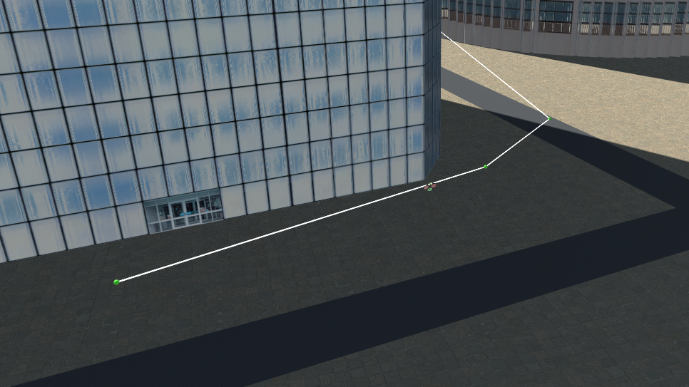

## Project: 3D Motion Planning
### Andrew Gutierrez, 2/20/21

Motion planning in action with path pruned using the Bresenham algorithm

---

# Required Steps for a Passing Submission:
1. Load the 2.5D map in the colliders.csv file describing the environment.
2. Discretize the environment into a grid or graph representation.
3. Define the start and goal locations.
4. Perform a search using A* or other search algorithm.
5. Use a collinearity test or ray tracing method (like Bresenham) to remove unnecessary waypoints.
6. Return waypoints in local ECEF coordinates (format for `self.all_waypoints` is [N, E, altitude, heading], where the drone’s start location corresponds to [0, 0, 0, 0].
7. Write it up.
8. Congratulations!  Your Done!

# Usage
The most basic planner is run with `python motion_planning.py` but there are a number of variations and options available as program arguments passed in the form `--argument=value` . 

## Available args:
- `goal_lon` / `goal_lon`: set a user defined goal position as a latitude/longitude value. There is a default goal of -122.397120, 37.793834 when not set. Technically you can set just one of these as they are separate args but that would not really be too useful
- `goal_alt`: define the target altitude, defaults to 0 and is not typically needed
- `plan`: set the planning algorithm, the default ('grid') uses the simple grid-based planner and `medial-axis` uses the medial axis planning algorithm. This is generally faster
- `prune`: set the planning algorithm, the default is `bresenham` which uses the bresenham ray-tracing algorithm.`collinearity` uses a simple collinearity check and any other value will not use any pruning

### Example Usage:
`python motion_planning.py --goal_lat= --goal_lon --plan=medial-axis --prune=bresenham`

---
# Writeup
## Starter Code Explained
The starter code contained in `motion_planning.py` and `planning_utils.py` provides much of the framework for getting the drone up and running with basic waypoint functionality. Much of the basic event-driven control code provided is similar to the previous project and the solution provided in `backyard_flyer_solution.py`. This defines how the drone transitions through the various states and sets up the callbacks to watch the important state information to properly transition through the mission. Unlike the previous project, there is now a `plan_path()` function to generate the waypoints that outline the flight path instead of the calculate box function. This is where the search problem is set up and performed, even though much of the important functionality lives in `planning_utils.py`. 

One utility is `create_grid()` which is used to generate the grid representation of the environment from the obstacle data contained in `colliders.csv`. The Action class creates an object representation of motions the craft can make and including some basic utilities used in the planning process. `valid_actions()` generates a list of all possible actions that are available to the vehicle at a given location on a given map. This is used to expand the nodes of the grid in search. Finally `a_star()` is probably the most important of the utilities as it is the core algorithm used in the planning process. It iterates through the search space and expands the nodes it thinks are most likely to lead to the goal first based on the cost to reach the current point and the heuristic which estimates the remaining cost. The heuristic defined here uses the straight line distance, since this is admissible, we can assume our planning will always generate the optimal path to the goal.

---

## Implementation Writeup
The implementation for the required elements are listed and described below. This describes the basic graph-based planner that runs by default. A medial-axis planner is also implemented and described under Extra Challenges.

### 1. Set your global home position
The global home is setup in `motion_planning.py` specifically in the beginning of `plan_path()` around line 123. The home position lat/lon values are parsed from the first first line of `colliders.csv` using NumPy utilities and written the drone as the home reference position.

### 2. Set your current local position
After the global home reference is established, the current global position member values are taken and converted to the local reference frame using the `global_to_local()` function on line 133 of `motion_planning.py`.

### 3. Set grid start position from local position
The local position value calculated in the previous step is then used to create the grid start position. Because the grid is discretized, the floating point local position first needs to be converted to an integer index and then offset by the grid offset to get the effective starting grid index. This process is done for both the north and east components.

### 4. Set grid goal position from geodetic coords
Currently, the code is setup to parse the goal position as program arguments in the form `--goal_lat=<value> --goal_lon=<value> --goal_alt=<value>`. If no arguments are provided, there is a fairly central default goal that is loaded. It should be noted that the `goal_alt` value will default to zero and can be omitted. The goal is then converted to local coordinates, again, using `global_to_local()` and then converted to a set of grid indices using the same process as the start. This position is then verified against the grid representation to make sure the goal is not within a building or it's safety margin. If the goal is invalid, the drone will abort the planning process and transition to landing.

### 5. Modify A* to include diagonal motion (or replace A* altogether)
The base A* has been modified to include diagonal motion at a cost of sqrt(2). That being said, this did not actually involve any changes to `a_star()` only to the Action class. Ordinal directions were added to the `Action` class with the appropriate weights along with the appropriate checks in `valid_actions()`. This is what is called within the A* implementation during the expansion step and it determines if the diagonal actions are possible.

### 6. Cull waypoints 
The code is setup to cull waypoints with either a collinearity check or with ray-tracing with the Bresenham Algorithm. The default is set to use Bresenham as it generally does a better job of cutting down on the number of waypoints. This is because the collinearity check only looks to see if the points lie on the same line whereas Bresenham actually checks to see if the waypoint actually serves a purpose. The path pruning algorithm can be set as a program argument in the form `--prune=collinearity`. If an invalid pruning option is provided, the waypoints will not be culled in any way resulting in a lot of acceleration and deceleration to hit the many waypoints.

## Execute the flight
### 1. Does it work/Simulator bugs
Yes the planner does work. There are a number of bugs in the simulator that can potentially cause issues. For instance, the drone currently spawns in the middle of a building and will clip up through the ceiling of it on takeoff in the most recent version of the simulator. This can be avoided by moving manually to a new start location before running the planning or by running an older version of the simulator. This will unfortunately break the heading commands outlined below. In addition, there is an issue in the drone comms where if the planning process takes too long, the sim will reject the waypoints even if they are generated correctly. I have verified that the planning is still successful by logging these longer paths and loading them in as a manual plan so this is not an issue with the planner. This is mostly a problem for the default grid-based planner since it has a much larger state space which generally takes longer to search. The Medial-Axis planner is much faster for longer paths and does not have this problem as often. There is not much I can do to avoid this problem short of editing the udacidrone source code. It is best to send goal positions that are relatively close to the start when using the default search. The error will take the following form when it happens:

`File "/home/<user>/miniconda3/envs/fcnd/lib/python3.6/site-packages/udacidrone/drone.py", line 117, in on_message_receive
    if (((msg.time - self._message_time) > 0.0)):
AttributeError: 'int' object has no attribute 'time'`
  
## Extra Challenges:

### 1. Heading Waypoints

If the motion planning routine is run in the latest version of the sim, it will also generate headings for the waypoints. This is done with a simple angle calculation between each waypoint and the next. It allows the drone to fly directly towards each waypoint as shown above instead of always facing the same direction and moving laterally towards the goal.

### 2. Medial-Axis Planner

In addition to the standard grid based planner, there is also an implementation of a graph based planner using the Medial-Axis transform. The "graph" is actually still represented by a grid just like the original planner, however it is generated by creating edges directly between obstacles. This implementation uses the scikitimage medial axis transform to generate the topological skeleton. This method significantly reduces the scope off the problem as compared to the grid-based planner since the search space now only contains the edges of the graph/skeleton. This makes the Medial-Axis planner run faster in most typical cases. 

One issue with this implementation is that the start and goal points are not guaranteed to fall on the graph. To resolve this, there is a routine added to `planning_utils.py` called `find_start_goal()` which gets the closest points on the graph to the start and goal. The drone will first have to fly too that start point before it travels on the road network and when it reaches the final waypoint on the graph, it then needs to head off to the goal. 

Planned path and graph from the medial-axis planner before pruining